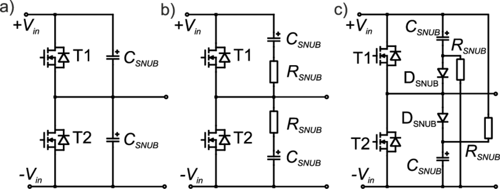

# RCD吸收电路常识

今天看到snubber电路（《电磁超声导波检测系统的设计》李丽滨），如下图[1]：

但觉得其中的吸收电路有问题，因此写这篇文章。

问题：

- R2和D2，R3和D3，为什么要建立一个直流通道，还是高压的（直接从HV到GND的直流通路），这样不是很浪费能量，徒增损耗吗？

## 真正的RCD缓冲吸收电路应该是怎样的？
首先去谷歌搜索RCD snubber，得到如下图：

这里有各种不同接法的RCD，RC，以及C结构的缓冲吸收电路（snubber）。同时，还有许多用于反激开关电源的RCD钳位（Clamp）电路。绝对没有第一张图给的那种RCD。
最接近的是文章《[COMPUTER AIDED DESIGN OF SNUBBER CIRCUIT FOR DC/DC CONVERTER WITH SiC POWER MOSFET DEVICES](https://www.researchgate.net/publication/277668484_COMPUTER_AIDED_DESIGN_OF_SNUBBER_CIRCUIT_FOR_DCDC_CONVERTER_WITH_SiC_POWER_MOSFET_DEVICES)》里面的这个图中的C) RCD snubber：

另外，我个人最常用的还是RC snubber电路，简单实用，下图来自[Snubber Circuit Design Analysis](http://electronicsbeliever.com/snubber-circuit-design-analysis/):

他能有效抑制开关二极管反向截至或者MOS管关闭时的震荡以及电压尖刺（主要是寄生的电感和结电容产生），如下是效果示意图：

以及我比较喜欢的RCD电路，如下图（来自《Design of RCD snubber considering wiring inductance for MHz-switching of SiC-MOSFET》这篇文献），看起来能量损失小一些。

## 参数设计计算

尚未

## 参考及引用

[1] 电磁超声导波检测系统的设计. 李丽滨
