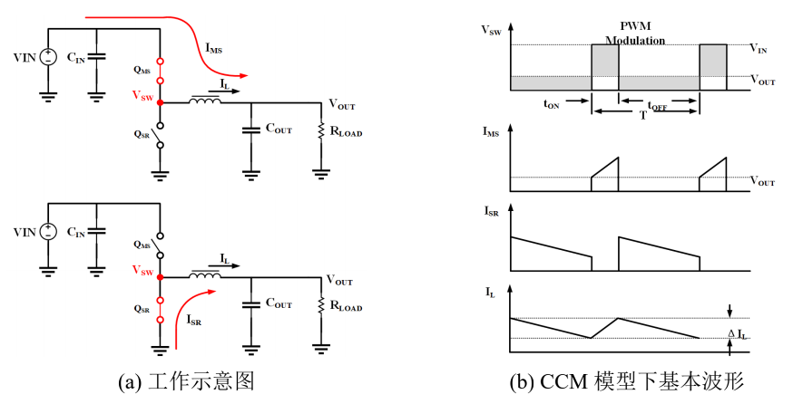
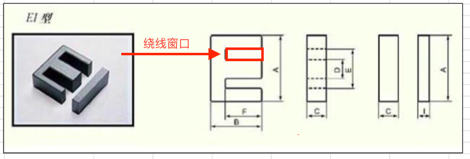
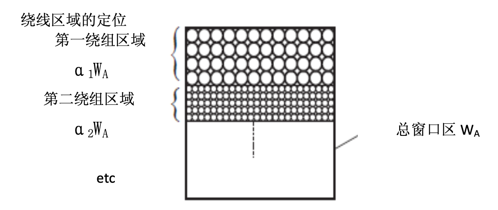
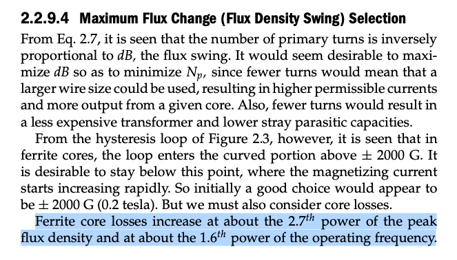

# 为什么要增加开关电源的开关频率

这个笔记是用来论证为什么开关频率越高，变压器（电感）体积可以做到越小，主要是从两个方面来论证频率越高，磁芯损耗可以做到越小，磁芯体积也越小：

a）磁芯饱和；  
b）磁芯损耗；

<!-- more -->

## 一、磁芯饱和

在这之前需要看我的其他文章《电感饱和度计算》和《磁芯损耗计算》，了解磁芯饱和的概念，对应的算法，以及磁芯损耗相关的原理及其计算。根据上面说的文章，电感或者变压器的磁通密度计算公式：

$$
B_{max} = \frac{LI_{max}}{NA_e}\leq B_{sat} \tag{1.0}
$$

其中

- $$B_{sat}$$是指磁芯的饱和磁通密度，由磁芯材料决定，这是我们应用磁芯材料时，磁芯材料所能达到的最大磁通密度，再大会发生饱和现象，所以必须保证$$B_{max} \leq B_{sat}$$，比如PC40的磁芯在100℃时，$$B_{sat}=0.35T$$

- $$N$$指绕组匝数；

下面我们以最简单的buck电路为例，见另一篇文章《buck电源有效值电流计算》，buck电路如下图：

假定我们固定电流纹波率 $$r$$，也就是固定$$\Delta{I_L}$$的大小，改变频率$$f$$，那么我们将会得到如下结论：

$$
L\propto \frac{1}{f} \tag{1.1}
$$

如何得出上述结论的呢？简单起见，我们假设（不算MOS管压降，电感电阻导致的压降）:

- 输入电压为$$V_{in}=10V$$;
- 输出电压为$$V_{out}=5V$$；
- 输出电流取$$I_{out}=10A$$；
- 电流纹波率取$$r=1$$,也就是$$\Delta{I_L}=r*I_{out}=10A$$，电感峰值电流$$I_{max}=I_{p}=I_{out}+\Delta{I_L}/2=15A$$，谷值电流$$I_{v}=I_{out}-\Delta{I_L}/2=5A$$

上面的buck电路中，$$T_{on}=T_{off}=\frac{1}{2}*\frac{1}{f}$$那么，电感量$$L$$和开关频率$$f$$的关系为：
$$
{L=\frac{V_{out}T_{off}}{\Delta{I}}=\frac{1}{2}\frac{V_{out}}{\Delta{I}}\frac{1}{f} = \frac{1}{2}\frac{V_{out}}{r*I_{out}}\frac{1}{f} \tag{1.2}}
$$

可以看出，在保证电流纹波率不变的情况下，电感量的大小与频率成反比，也就是公式(1.1)说的$$L\propto \frac{1}{f}$$。

将公式1.0和变形得到：

$$
{NA_e \geq \frac{LI_{max}}{B_{sat}}}
$$

也就是说变压器的最小$$NA_e$$参数必须满足公式(1.3)，才能保证磁芯不会因饱和而损坏电源：

$$
{(NA_e)_{min} = \frac{LI_{max}}{B_{sat}} \tag{1.3}}
$$

结合公式1.2，有

$$
\begin{aligned}
(NA_e)_{min} &=\frac{I_{max}}{B_{sat}}*\frac{1}{2}\frac{V_{out}}{r*I_{out}}\frac{1}{f}\\
&= \frac{1}{2} \frac{(1+0.5r)*I_{out}*V_{out}}{B_{sat}*r*I_{out}} \frac{1}{f}\\
&= \frac{1}{2} \frac{(1+0.5r)V_{out}}{rB_{sat}} \frac{1}{f}\\
&\propto \frac{1}{f}
\end{aligned} \tag{1.4}
$$

公式(1.4)中，

而且，$$NA_e$$正是由磁芯和骨架大小决定的。

- 当电流大小不变，绕组电流密度也不变的情况下，绕组线径大小不变，那么就会有，$$N\propto{A_w}$$，$$A_w$$为磁芯绕线窗口面积；

所以
$$ 
{(A_{w}A_{e})_{min} \propto (NA_e)_{min} \propto \frac{1}{f} \tag{1.5}}
$$

也就是说，开关频率越高，变压器的$$(A_{w}A_{e})$$可以选用越小的，这就是非常重要的磁性器件选型设计法则——AP法。

对于这个设计法则，书上和网络上有许多解释，如：a）：[讲述AP法计算电源变压器的来龙去脉！](http://www.zhangfeidz.com/bbs/forum.php?mod=viewthread&tid=235)

b）：Pressman的《Switching Power Supply Design 3ed》书中有更详细的描述，见第七章-Transformers and Magnetic Design，重点讲解在7.6.1 The Area Product Figure of Merit.

重要的思想就是找到AP足够大的变压器，AP指的是：

$$
{AP=A_wA_e}
$$

如下图EI磁芯所示，其中：

- $$A_e = D*C$$指的是磁芯的横截面积，理论上磁路上的横截面积都应该一样，两边的磁芯横截面积相加等于中间的横截面积，也就是$$A-E=D$$；

- $$A_w = \frac{1}{2}(E-D)*F$$，图中所示的绕线窗口有2个，但我只是指出其中的一个，也只需要计算其中一个的面积即可；

绕线窗口的绕线示意图如下：

可以很直观看出，窗口面积越大，绕线的匝数可以越多（或者说线径越大）。

就是我们在选择磁芯骨架并设计变压器（电感）的时候，会先看看磁芯的绕线窗口和磁芯的横截面积的乘积是否满足要求，这绝对不是拍脑门，而是有理论依据的。

### 二、磁芯损耗

不同磁芯有不同磁芯的磁芯损耗模型和损耗大小，以下面Pressman的《Switching Power Supply Design 3ed》书中说的铁氧体的磁芯损耗近似公式为例：

表达成公式就是：

$$
L_{loss} = \alpha (B_{max})^{2.7}(f)^{1.6} \tag{2.0}
$$

其中：

- $$\alpha$$是一个常量

根据公式1.1，$$L\propto \frac{1}{f}$$，又因为在一样的电流（输入输出电流）下，$$B_{max}\propto L$$得到：$$B_{max} \propto \frac{1}{f} $$，也就是：
$$
B_{max} = \beta \frac{1}{f} \tag{2.1}
$$

其中：

- $$\beta$$是一个常量

由公式2.0和公式2.1得到：
$$
\begin{aligned}
L_{loss} &= \alpha  (\beta \frac{1}{f})^{2.7}(f)^{1.6}\\
&= \alpha \beta^{2.7} f^{-1.1}
\end{aligned} \tag{2.2}
$$

所以，很容易得到结论，磁芯损耗和开关频率成负相关，开关频率越高，磁芯损耗越小。

对于其他材料的磁芯，磁芯损耗的拟合公式也相差不大，这里不再赘述。

### 三、增大开关频率带来的其他好处及问题

好处：

- 电容容量可以小一些，在一样的纹波要求下；

坏处：

- 开关管(1)本身的开关损耗（区别于导通损耗），势必会增加（主要是硬开关拓扑中）；
- 二极管反向恢复时间要求变高，需要更快的反向恢复时间；
- 电路各处的寄生参数（尤其是寄生电容），要求做到更小，这样才能保证开关的损耗不会太高；
- 高$$dV/dt$$导致的EMI问题，导致电源的EMC问题会更严峻；
- 变压器的临近效应，趋肤效应，都会增强，增加损耗，需要使用更细的漆包线，用三明治等绕法来降低这些铜损。

## 四、结论

不论是为了避免磁芯，还是为了降低磁芯损耗，增加开关频率都是有好处的。

开关频率升高，是可以降低磁性器件感量及体积，降低磁芯损耗。同时还能顺带降低输入输出电容的容量大小，也能实现降低成本和体积的目的。但对于功率半导体器件本身，包括二极管和开关管，其开关损耗势必会增大，就需要降低它们的结电容和提高它们的开关速度来解决（包括二极管的反向恢复时间等），正好SiC器件和GaN器件在这方面是有优势的。

另外，根据经验法则，Pressman的《Switching Power Supply Design 3ed》书中强调的是，开关频率高于50kHz，就需要降低磁通密度的大小，因为开关频率高，损耗太大，得降低磁通密度来达到降低损耗的目的。而开关频率小于50kHz，可以只计算最大磁通密度，保证其不要让磁芯达到饱和导致电源故障即可。

注：
（1）无特殊说明，本文中说的开关管指:Si MOSFET，IGBT，GaN HEMT， SiC MOS，功率三极管等；
