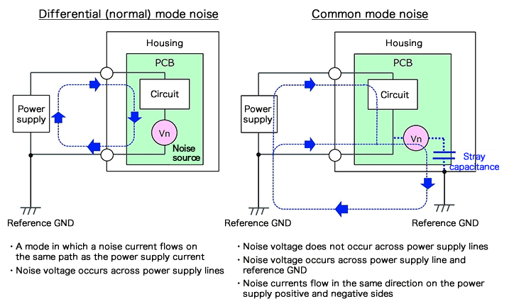
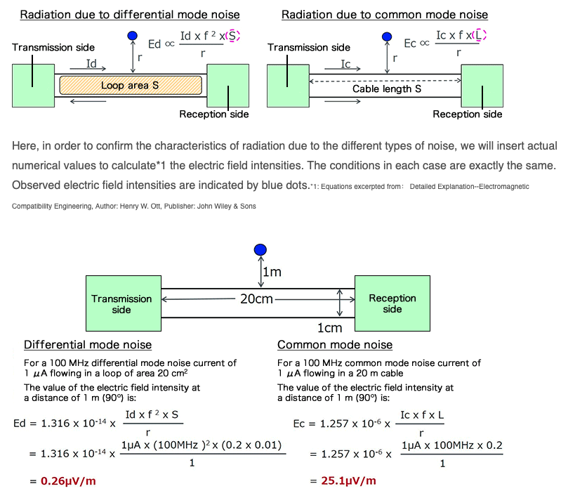
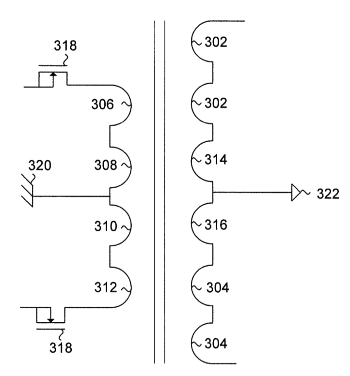
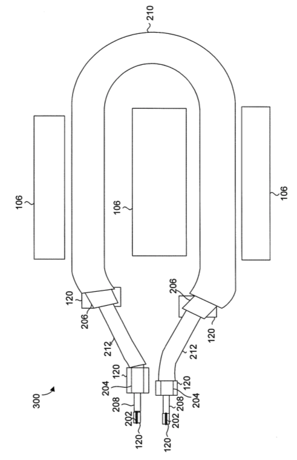

# 开关电源中的共模干扰

开关电源中变压器如何产生共模干扰，如何降低或者解决？

## 什么是共模干扰

共模干扰和差模干扰都会影响EMC性能。

他们的区别如下图[1]，以市电为例，差模就是L、N线之间的差分干扰信号（噪声，谐波），共模就是，L、N共同对地线（输出级，外壳等）的干扰信号。

## 如何计算评估共模噪声的大小

如下图[1]

结论就是，共模干扰一般情况下比差模干扰更严重。

另外就是，X电容可以做得很大，用于滤除差模干扰，但是，Y电容就被限制了容量大小（漏电流限制），因此需要加大共模电感来滤除共模干扰了。

## 共模干扰解决

1. 共模滤波器，比如EMC电路中的Y电容和共模电感
2. 降低开关的速度，也就是降低$$dv/dt$$
3. 解耦或者降低耦合

滤波器和简单粗暴降低$$dv/dt$$比较简单，这里就不再详解，但解耦或者降低耦合，说起来容易，做起来难，这又该如何解决呢？

比如如说隔离变压器，就多少可以做到降低共模干扰的效果，但如何做这个隔离变压器，才能达到更好的效果呢？

基思利有一个专利：CN 104183374 A，就是讲这个的，他们真是天才！

如下图：

图中，为推挽拓扑的变压器，原边和副边都有2个绕组（导线），原边绕组是：2Ts+2Ts；副边绕组是3Ts+3Ts，这里面屏蔽的精髓就是：

1. 原副边绕组的中心抽头都各自接入原副边的地，电势差恒为原副边地的电势差。（当然，在基思利的具体仪器设备中，为了开关管的驱动设计方便，原边的中心抽头其实接入了Vdd，而开关MOS管的S极接的是原边地（图318））；
2. 图中，原边的308、306和副边的314、302；原边的310、312和副边的316、304，他们通过同轴线分别耦合在一起；
3. 在开关过程中，磁芯的电磁场变化产生电动势（法拉第电磁感应定律），在同轴线的各处，内外层导体的电势的变化率始终都是相等的，以同轴线绕组的轴向对比，越是靠近中心抽头，$$dv/dt$$越接近0，而越是远离中心抽头$$dv/dt$$绝对值越大，径向对比，同轴线的里层和外层绕组都是同样的$$dv/dt$$，同时电势差也都是维持恒定的（就是图中原边地和副边地的电压差），没有因为开关而产生不必要的共模干扰。

疑问：

1. 图中308和314的在同一个地方作为绕组的起始位置，这个似乎不容易处理，因为一个是原边绕组，一个是副边绕组，解决方案如下：
   1. 将变压器放置到原、副边中的其中任意一侧（与一般变压器跨过原、副边不一样），这里假设是放在原边；
   2. 然后将所有绕组的引脚都引向变压器靠近PCB隔离带，也就是靠近副边的一侧（跟一般的变压器放两侧不一样）；
   3. 同轴线绕组的外层就在PCB的原边焊接，而里层绕组和屏蔽介质就跨过隔离带引向副边再焊接，如下图：
   

   
   

   图中是3同轴，而不是双同轴，而且绕组只有1Ts，这里是为了其他的实施问题，请先忽略。

参考及引用：

[1] Differential (Normal) Mode Noise and Common Mode Noise－Causes and Measures <https://techweb.rohm.com/knowledge/emc/s-emc/01-s-emc/6899>
