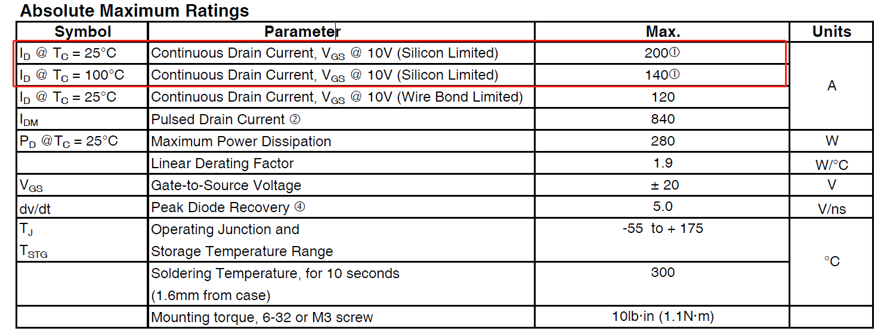
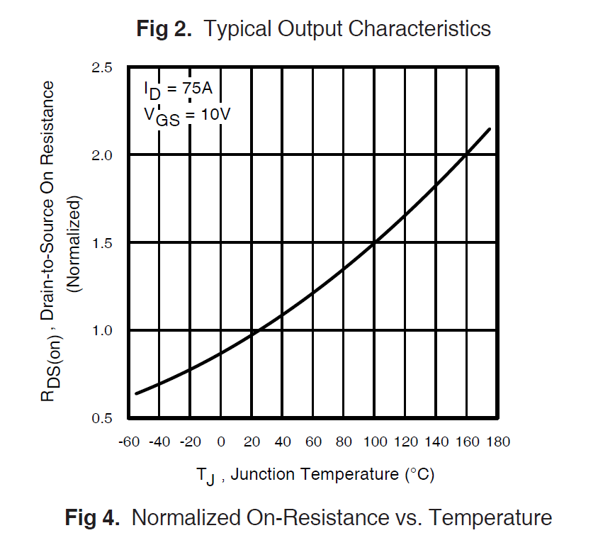
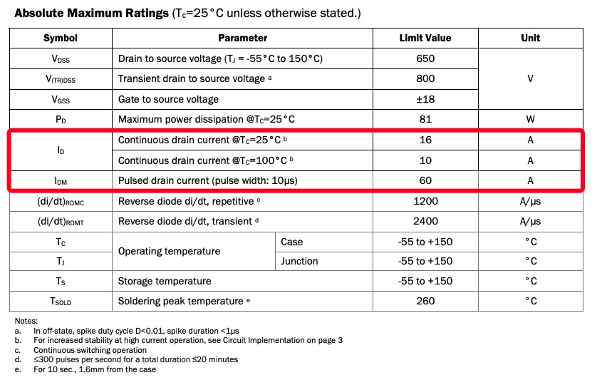

# MOSFET-datasheet解读

1. 雪崩（温度系数），需要测试数据图片。
2. Ron（温度系数）。
3. Normalized 归一化参数
4. IV的SOA和温升-时间曲线
5. MOS的特性

## 最大电流

功率MOSFET中，一般会标明两种最大电流：持续最大电流（直流）和脉冲最大电流。他们分别是如何限定的？

### 最大持续 DS 电流

IRFP3206PbF的规格书对于最大持续电流的限定，如下图[1]:

在外壳温度保持25℃的情况下，持续电流为**200A**，该电流数值是如何得到的？

其实很简单，是最高结温限制，也就是，在外壳温度为25℃时，使得结温为150℃的持续电流就是最大持续电流。

根据结温计算公式：

$$
\begin{aligned}
T_J = R_{\theta JC} \cdot P_D + T_C
\end{aligned}
$$

其中：

- $$T_J$$为结温
- $$R_{\theta JC}$$为 junction（半导体结） 到 case (封装外壳) 的热阻
- $$P_D$$为耗散功率，也就是MOS管损耗功率
- $$T_C$$为外壳温度

器件导通时，有：

$$
\begin{aligned}
P_D = I_{DS}^2 \cdot R_{DS(on)}
\end{aligned}
$$

其中:

- $$I_{DS}$$ 为MOS管的DS电流
- $$R_{DS(on)}$$ 为MOS管的导通电阻，此电阻与结温相关，若是MOS管的结温为150℃，那么需要按照150℃时的导通电阻计算MOS管的导通损耗

那么有：

$$
\begin{aligned}
I_{DS} =\sqrt {\frac{T_{J} - T_C}{R_{\theta JC} \cdot R_{DS(on)}}}
\end{aligned}
$$

参考IRFP3206PbF规格书，在25℃时，有 $$R_{DS(on)\_max} = 3.0m\Omega$$，但因为最高工作的结温在150℃，那么根据$$R_{DS(on)}$$ 的温度系数曲线，可以得到$$R_{DS(on)\_max\_150℃} = 1.91 \cdot 3.0m\Omega = 5.73m\Omega$$, 系数**1.91**为使用尺子直接在曲线上测量得到。

且，根据规格书中，$$R_{\theta JC}\_max = 0.54 ℃/W$$。得到：

$$
\begin{aligned}
I_{DS\_max\_25℃} &=\sqrt {\frac{T_{J\_max} - T_C}{R_{DS(on)} \cdot R_{\theta JC}}} \\
&= \sqrt {\frac{150℃ - 25℃}{0.54 ℃/W \cdot 5.73m\Omega }} \\
&= 200.99A
\end{aligned}
$$

与标称值200A相差0.5%，鉴于温度系数测量的不准确度（在图中曲线直接测量得到$$R_{DS(on)}$$的温度补偿1.91）大于1%，最终电流计算结果与datasheet标称值偏差0.5%这是合理的。

另外，GaN FET 有相同的算法：

比如： TPH3206PSB GaN FET，有[2]:

根据TPH3206PSB datasheet，有：

- $$R_{\theta JC}\_max = 1.55 ℃/W$$
- $$R_{DS(on)\_typ\_150℃} = 308m\Omega$$

最高结温和器件外壳温度仍然取值150℃和25℃，那么就有：

$$
\begin{aligned}
I_{DS\_max\_25℃} &=\sqrt {\frac{T_{J\_max} - T_C}{R_{DS(on)} \cdot R_{\theta JC}}} \\
&= \sqrt {\frac{150℃ - 25℃}{1.55 ℃/W \cdot 308m\Omega }} \\
&= 16.1813A
\end{aligned}
$$

这与规格书标称的最大持续电流**16A**一致相对应。

另外，最高结温和器件外壳温度仍然取值150℃和100℃，那么就有：

$$
\begin{aligned}
I_{DS\_max\_25℃} &=\sqrt {\frac{T_{J\_max} - T_C}{R_{DS(on)} \cdot R_{\theta JC}}} \\
&= \sqrt {\frac{150℃ - 100℃}{1.55 ℃/W \cdot 308m\Omega }} \\
&= 10.23A
\end{aligned}
$$

这与规格书标称的10A也是吻合的。

相对来说，这个100 ℃壳温下的最大持续电流这个参数还更有意义些，因为正常使用的时候，散热条件基本不可能保持25 ℃的壳温，倒是100 ℃是经常遇见的。

疑问：

- IRFP3206PbF的最大持续电流200A是根据最高工作结温为150℃计算的，但根据IRFP3206PbF的规格书，它的最高工作结温应该是175℃啊！为什么不是根据175℃计算？
- 为什么BSC017N04NS不论是 $$T_{C} = 25℃$$ 还是 $$T_{C} = 100℃$$ 的条件下，$$I_{DS\_max}$$ 标称值都是 100A，而根据计算，$$I_{DS\_max\_25℃} = 226A$$ , $$I_{DS\_max\_100℃} = 143A$$；
- STF13NM60N 和 STF24NM60 不同封装的 $$I_{DS\_max}$$ 标称值是一样的，但其热阻是根据封装而有所不同的，也就是根据热阻推导计算，他们的最大持续电流值应该是不一样才对。不同封装的 $$I_{DS\_max}$$ 标称值一样导致有些封装的 $$I_{DS\_max}$$ 标称值是符合上面提到的公式，但有些不满足上面的公式，只能说ST的工程师也太懒了吧！应用工程师还得自己反向推导多一次？

总结来说，根据上面的公式推导最大持续电流 $$I_{DS\_max}$$ 还有些问题：

- 有些器件的 $$I_{DS\_max}$$ 标称值是根据导通电阻典型值 $$R_{DS(on)\_typ\_150℃}$$ 计算得到，有些是根据导通电阻最大值 $$R_{DS(on)\_max\_150℃}$$ 计算得到；
- 有些器件是有些封装与公式对应，有些封装就与公式不对应（如上面说的ST的MOS管 STF13NM60N 或者 STF24NM60）；
- 有些器件，不论怎么计算，都对应不上，比如上面提到的BSC017N04NS；
- 很多器件没有给出150℃下的导通电阻 $$R_{DS(on)\_150℃}$$ ，需要根据 $$R_{DS(on)}$$ - $$T_{J}$$ 关系曲线去计算得出，会影响准确度。

## 参考及引用

[1] IRFP3206PbF. datasheet. 3/3/08 <www.irf.com>
[2] TPH3206PSB GaN FET. datasheet <https://www.transphormusa.com/en/document/650v-cascode-gan-fet-tph3206psb/>
[3] IXBK55N300-datasheet(IGBT)
