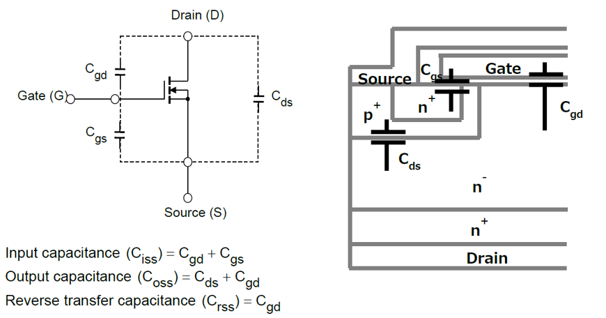

# MOSFET寄生电容

本文主要介绍MOSFET中，$$C_{oss}$$, $$C_{iss}$$, $$C_{rss}$$，以及他们和$$C_{gs}$$，$$C_{gd}$$，$$C_{ds}$$的关系。

如下图[1]：

图中的MOSFET是典型的功率MOSFET（垂直沟道）结构截面图。

$$C_{iss}$$：输入电容
$$C_{oss}$$：输出电容
$$C_{rss}$$：反向传输电容

且有：

$$C_{iss} = C_{gd}+C_{gs}$$
$$C_{oss} = C_{gd}+C_{ds}$$
$$C_{rss} = C_{gd}$$

查看典型的MOSFET的寄生电容曲线，随便找一款，IPP60R099P6：

属性	参数值
商品目录	MOS(场效应管)
漏源电压（Vdss）	600V
连续漏极电流（Id）（25°C 时）	37.9A(Tc)
漏源导通电阻	99mΩ @ 14.5A,10V
最大功率耗散（Ta=25°C）	278W(Tc)

根据其规格书，寄生电容曲线如下：

可以看到跟二极管，三极管等一样，基本上电容是随着电压升到而降低的（但$$C_{rss}$$有拐点向上，为何？）。

参考及引用：

[1] Power MOSFET Electrical Characteristics. TOSHIBA
[2]理解MOSFET时间相关及能量相关输出电容Coss(tr)和Coss(er)-刘松-万国半导体元件(深圳)有限公司
