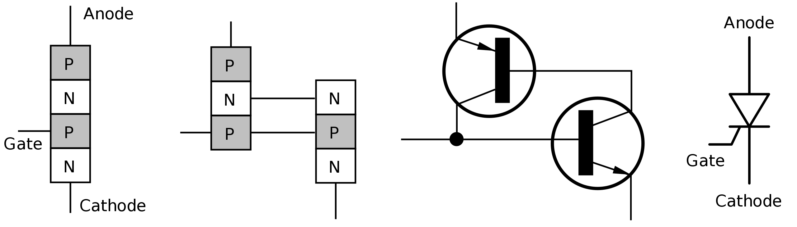
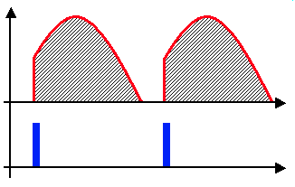
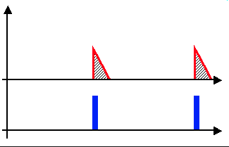

# 有哪些半导体开关管

本文说的是功率半导体。

半导体开关管都有哪些（结构），还有哪些材料。

结构上有：

1. 晶体闸流管（Thyristor）或可控硅（SCR: silicon controlled rectifier)
2. (TRIAC: Bidirectional Thyristor)
3. 可关断晶闸管(GTO: Gate Turn-Off thyristor)
4. (IGCT: Integrated Gate-Commutated Thyristor)
5. 功率電晶體(Power BJT)
6. (IGBT: Insulated Gate Bipolar Transistor)
7. MOS控制閘流體 (MOS-controlled Thyristor, MCT)
8. (Power MOSFET)

另外：GTR是什么？

## 1、晶闸管（SCR)

参考：

- 晶闸管 <https://zh.wikipedia.org/wiki/%E6%99%B6%E9%96%98%E7%AE%A1>
- Thyristor <https://en.wikipedia.org/wiki/Thyristor>
- Silicon controlled rectifier <https://en.wikipedia.org/wiki/Silicon_controlled_rectifier>

### 定义

晶闸管，指的是具有四层交错P、N层的半导体器件。

- 是个电流控制器件
- 是半控器件，控制开通，但不可控制关断。一旦用控制信号开启后，就算不再注入控制信号（电流），器件也会维持导通状态直到电流下降到接近于零

*本文将晶闸管（Thyristor）和可控硅（SCR）当作是一种东西，是同义词[1]*

半导体结构及电路符号（Structure on the physical and electronic level, and the thyristor symbol）:

Thyristors have three states:

1. Reverse blocking mode – Voltage is applied in the direction that would be blocked by a diode
2. Forward blocking mode – Voltage is applied in the direction that would cause a diode to conduct, but the thyristor has not been triggered into conduction
3. Forward conducting mode – The thyristor has been triggered into conduction and will remain conducting until the forward current drops below a threshold value known as the "holding current"

### 特点

I-V特性曲线

从曲线中可以看出：

- 器件开启，需要$$I_G \gg 0$$
- 当$$I_G = 0$$，且$$V_{AK}$$较小时，器件处于关闭状态，电流较小，但也会随着$$V_{AK}$$增大而增大
- 当$$I_G = 0$$，在阳极电压$$V_{AK}$$达到$$V_{BO}$$时，器件击穿，电流达到一个(阈值电流)latching current $$I_{L}$$，然后电压进入负电流系数状态（电流越大，两端电压约小，负微分电阻[2]）
- 当$$I_G = 0$$，且AK极电压击穿后，进入负微分电阻状态，是有可能电流一直升高(同时电压一直降低)，使得$$I_{AK}$$大于第二个阈值电流(holding current )$$I_{H}$$，也就是$$I_{AK}>I_{H}$$，那么，器件将会和$$I_G \gg 0$$那样，处于完全导通状态
- 当$$I_G > 0$$（且不够大，不足以将器件完全开启），其特性和$$I_G = 0$$差不多，电流$$I_{AK}$$也会随着$$V_{AK}$$增大而增大，只是$$V_{AK}$$一样时，$$I_{AK}$$更大些。同时，达到阈值电流$$I_{L}$$时，$$V_{AK}<V_{BO}$$，然后进入负微分电阻状态，$$I_{AK}$$也可能超过$$I_{H}$$，进入完全导通状态。
- 也就是说，只要$$I_{AK}>I_{H}$$，那么器件就一直处于导通状态，没办法通过控制$$I_G$$的大小去控制器件的开关。
- 这是一个能开，不能关的器件。

缺点：

1. 不能控制关断，需要电流降低，自动进入关断状态
2. 压摆率$$dv/dt$$太高，会导致导通（可用snubber电路抑制）

### 应用

1. 高压直流传输HVDC（高电压，大电流）
2. 应用于工频的开关，通过控制导通的相位角，达到调节输出电压有效值的目的（比控制如钨丝灯），如下图，红色线下的阴影部分是有输出的，蓝色脉冲是触发信号，触发后，晶闸管持续导通，直到电压为零（电流也为零）。
   

   
   

   

   
   

另外，有双向晶闸管，为两个单向晶闸管反向串联构成。

疑问：**为什么电路符号（两个三极管）看起来像是达林顿管，达林顿是怎样的接法？**

## 2、TRIAC

TRIAC是什么<https://en.wikipedia.org/wiki/TRIAC>

## GTR，IGBT

## 总结

## 疑问

## 引用

[1] 根据维基百科词条**Silicon controlled rectifier** <https://en.wikipedia.org/wiki/Silicon_controlled_rectifier>:
 Some sources define silicon-controlled rectifiers and thyristors as synonymous, other sources define silicon-controlled rectifiers as a proper subset of the set of thyristors, those being devices with at least four layers of alternating n- and p-type material. According to Bill Gutzwiller, the terms "SCR" and "controlled rectifier" were earlier, and "thyristor" was applied later, as usage of the device spread internationally.

[2] 负阻特性(负微分电阻效应): <https://baike.baidu.com/item/%E8%B4%9F%E5%BE%AE%E5%88%86%E7%94%B5%E9%98%BB%E6%95%88%E5%BA%94>; <https://zh.wikipedia.org/wiki/%E8%B2%A0%E9%98%BB%E7%89%B9%E6%80%A7>

[3] <https://en.wikipedia.org/wiki/TRIAC>