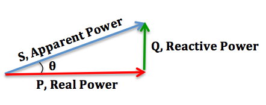
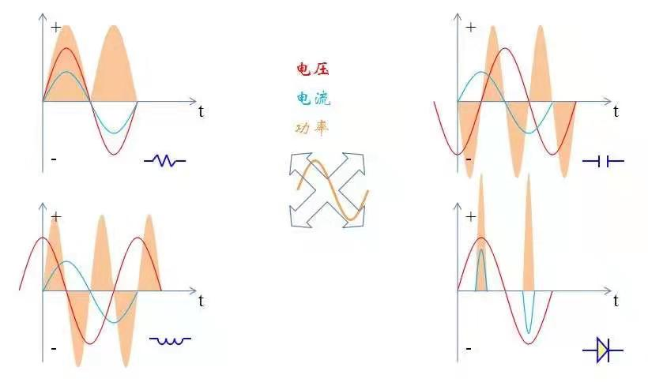

# 功率因素PF

功率因数讲的主要是交流电传输系统中的一个参量（AC电路，非DC）。

DC传输是否也有这样的问题，下文不做讨论。

## 什么是功率因数PF

参考维基百科的定义：[Power factor](https://en.wikipedia.org/wiki/Power_factor)

功率因数(PF:Power Factor)：用于表征电路中有功功率与视在功率之间的比值。

这需要先解释什么是有功功率，什么是视在功率，以及无功功率。

- 视在功率（apparent power），以S来表示，其单位是伏安（VA），是电压和电流有效值的乘积。
- 实功率（real power，也称为有功功率，active power），以P来表示，其单位是瓦特（W）。
- 无功功率（reactive power），以Q来表示，其单位是乏尔（var），或称为无功伏安或是乏。

其中，视在功率最简单粗暴：

$$
\begin{aligned}
S &= I_{rms} \cdot V_{rms}
\end{aligned}
$$

有功功率为总传输能量除以时间（在一段时间T内）：

$$
\begin{aligned}
P &= \frac{\int_0^T i_t\cdot u_t dt}{T} 
\end{aligned}
$$

视在功率，有功功率，无功功率有三角关系如下：

很明显有：

$$
\begin{aligned}
S^2 = P^2 + Q^2
\end{aligned}
$$

我们讨厌无用功，因为无用功会平白增加电力传输系统的电流有效值，增加电路传输过程中的损耗，对开关，插座，保护电路模块等都提出了更高的要求，但却没有向用电设备传输更多的有功功率（有功功率越大，传输的能量越大）。传输电力，是为了传输电能，而不是为了传输电流。

因此，引入了功率因数PF的概念，定义为有功功率和视在功率的比例，一般介于0-1之间（若是小于0，那么代表有功功率为负，也就是能量传输方向已经反向，这里不做讨论）。

$$
\begin{aligned}
PF = \frac{P}{S}
\end{aligned}
$$

其中，$$P$$为有功功率，$$S$$为视在功率。

下面的讨论一般只专注于有功功率和视在功率功率，探讨如何提高PF值，不详细讨论无用功率。

## PF和什么有关系

先说结论，总的来说，PFC低的原因有二：

1. 相位角度相差较大；
2. 总谐波失真太大；

### 分析过程如下

如下图是常见的负载模型，分别是：1）电阻性负载；2）电容性负载；3）电感性负载；4）二极管整流（输出为电容负载）性负载，他们的电流、电压以及瞬时功率波形。

现在先做简单分析，后面再进行计算验证（时域和频域）；

1. 电阻性负载谐波小，理论上$$THD=0$$，同时电流电压相位差为为零，也就是$$\theta=0^{\circ}$$，那么理论上$$PFC=1$$；
2. 电容性负载谐波也小，理论上$$THD=0$$，电流波形比电压波形超前90度，也就是$$\theta=90$$，理论上$$PFC=0$$（有功功率为零，因为图中粉红色部分，也就是瞬时功率，周期平均值为0。）；
3. 电感性负载谐波也小，理论上$$THD=0$$，电流波形比电压波形滞后90度，也就是$$\theta=-90^{\circ}$$，理论上$$PFC=0$$；
4. 二极管整流负载，谐波比较大，$$THD$$因情况而异，应介于0～1之间，但是相位差接近于零（实际电路场景中，电流会稍微超前电压），假定$$\theta=0 ^{\circ}$$。因波形特殊，PFC难以直接判定，不过也是介于0-1之间；

理想的容性负载和感性负载的有功功率为零，是因为负载在一段时间内消耗能量进行充电，另一段时间内又释放能量，也就是反向输出能量。

实际的容性负载和感性负载仍会消耗一定的能量，他们会有等效串联电阻（ESR），或者其他的特性，导致功率损耗，电流电压相位角也不会是刚好$$\pm 90^{\circ}$$。比如电容器件，一般会在规格书标注损耗角，代表实际的阻抗角度和$$90^{\circ}$$之间的差值。

### 线性负载

线性系统中，且电压电流都是完美的正弦波，那么有：

$$
\begin{aligned}
|P|=|S|\cos \theta
\end{aligned}
$$

也就是功率因数低都是因为电流波形的位移导致的，只要设法把相移移动到$$\theta = 0^{\circ}$$就能实现$$PF=1$$。

### 非线性负载

若是假设基波的相位角度为0，那么有：

$$
\begin{aligned}
PF_{distortion} &= {\frac {I_{1}}{I_{rms}}}\\
&= {\frac {I_{1}}{\sqrt {I_{1}^{2}+I_{2}^{2}+I_{3}^{2}+I_{4}^{2}+\cdots }}}\\
&={\frac {1}{\sqrt {1+{\frac {I_{2}^{2}+I_{3}^{2}+I_{4}^{2}+\cdots }{I_{1}^{2}}}}}}\\
&={\frac {1}{\sqrt {1+THD_{i}^{2}}}}
\end{aligned}
$$

其中：$$I_{1}$$指基波电流；

$$THD_{i}$$为负载电流的总谐波畸变（$$i$$是指电流）。

$$
\begin{aligned}
THD_{i} &= {\frac {\sqrt {\sum_{h=2}^{\infty }I_{h}^{2}}}{I_{1}}}\\
&={\frac{\sqrt {I_{2}^{2}+I_{3}^{2}+I_{4}^{2}+\cdots }}{I_{1}}}
\end{aligned}
$$

若是考虑基波$$I_{1}$$的位移为$$\theta$$，那么有：

$$
\begin{aligned}
PF_{distortion} ={\frac {\cos \theta}{\sqrt {1+THD_{i}^{2}}}}
\end{aligned}
$$

## 什么是THD

这里谐波指的是THD（total harmonic distortion），总谐波失真。

周期信号可以用傅立叶变换分解为1、2、3、4...次谐波（正弦波）的和，其中的1、2、3、4...次指的是频率是周期信号本身的倍数。

## THD和PF的关系

## PFC功率因数校正器

**PFC（Power Factor Correction，功率因数校正器）**：指电路中为了提高负载PF而设计的一类电路或者模块。

### 相位角导致的PF值计算

### THD导致的PF值计算

### 频域计算（公式和波形）

### 时域计算（公式和波形）
