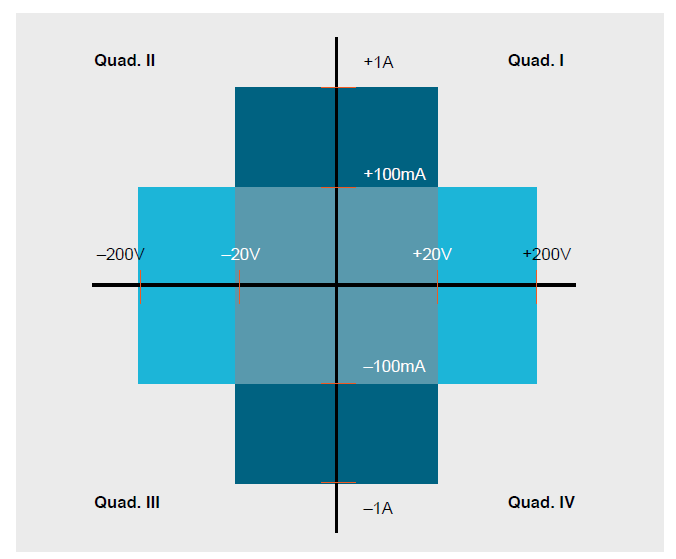

# 四象限开关电源

如下图，四象限电源代表输出电压，电流的正负方向可以是四种任意组合，如下图（参考Keithley 2450 SMU）：

1. **Quad.I**：输出正电压，正电流；
2. **Quad.II**：输出负电压，正电流；
3. **Quad.III**：输出负电压，负电流；
4. **Quad.IV**：输出正电压，负电流；

根据LT8714的拓扑，其声称可以做4象限电源，但我怎么看，都觉得有点奇怪。因为看拓扑似乎不能实现四象限，如下图：

比如说，输出第四象限，输出正电压，负电流，也就是电流从输出端流入开关电源，但看不出来，如何将更低电压的输出通过开关电源返回Vin端，或者通过开关管损耗掉。
