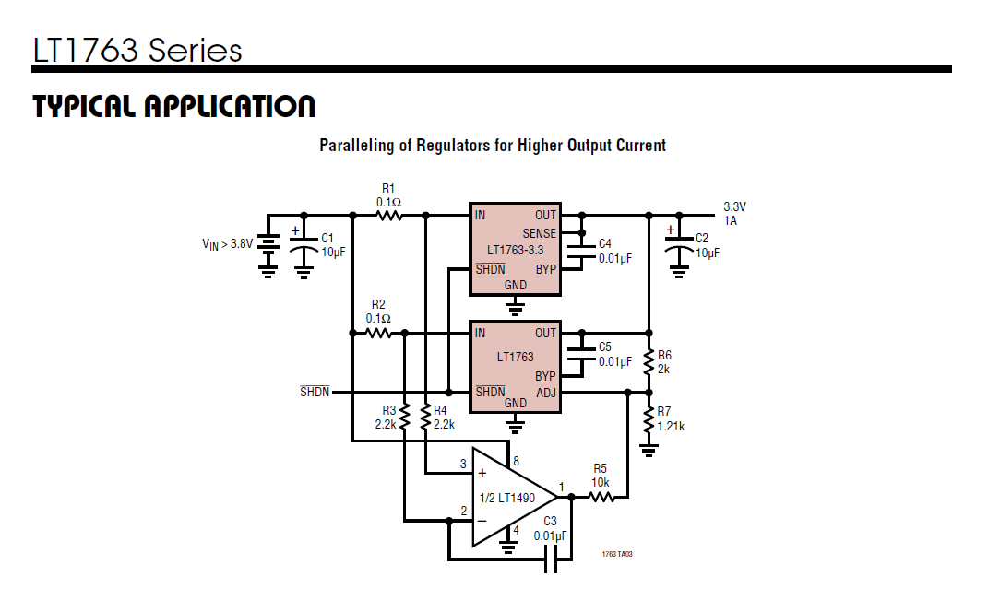
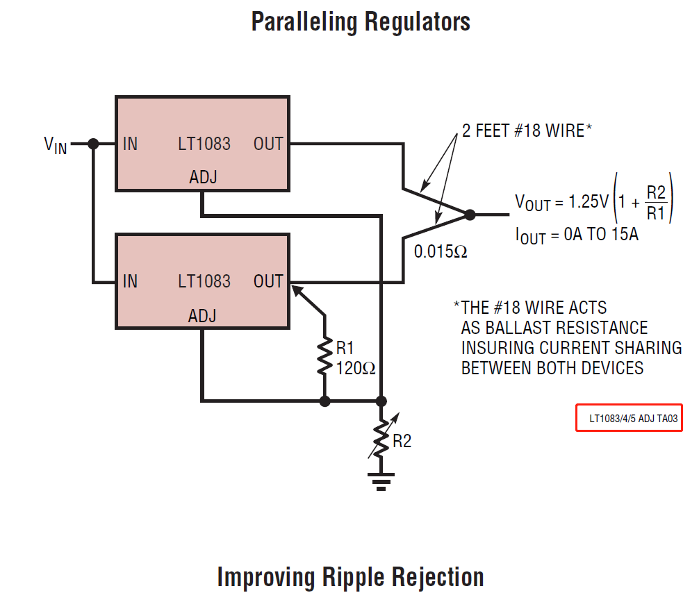

# 并联均流技术

LDO如何做并联均流

1. 使用可调LDO，在输出或者输入点采集电流，通过反馈电路，调节ADJ引脚电压，进一步控制输出电压，最终达到均流的效果(见LT1763的datasheet)；
2. 将精度做得非常高，同时，稍微加一点点输出电阻，实现自均流效果(见LT1083的datasheet)，甚至，当输出精度更高时，PCB走线电阻和PCB本身的输出电阻，就能够做到自均流了；

## 参考及引用
